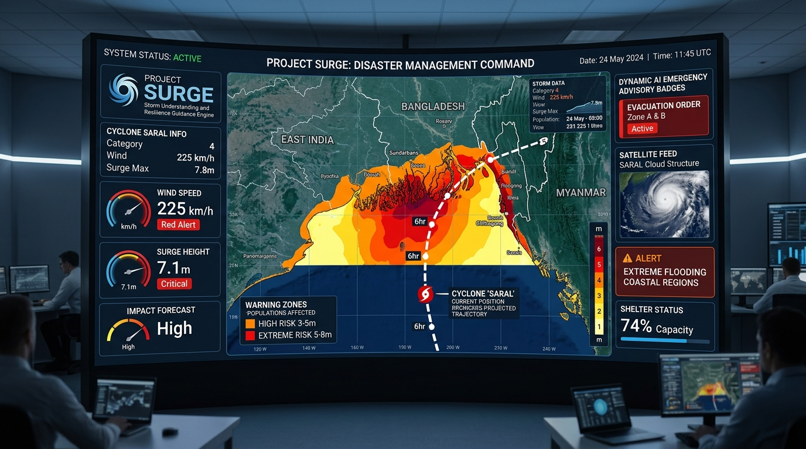
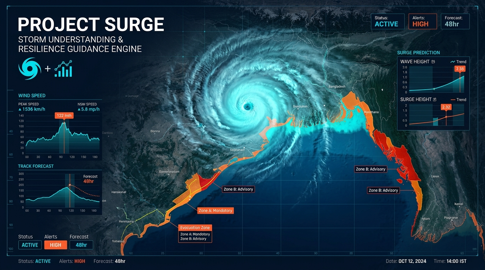
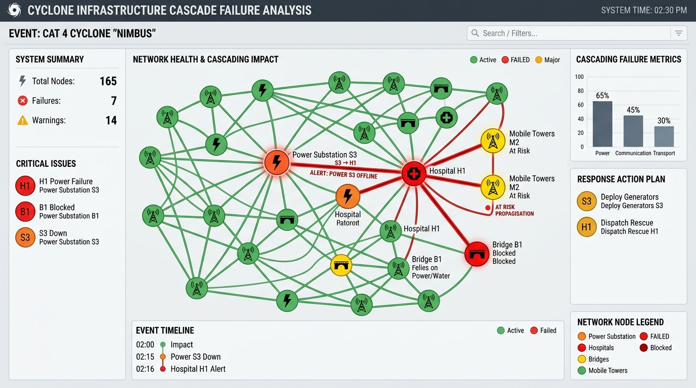
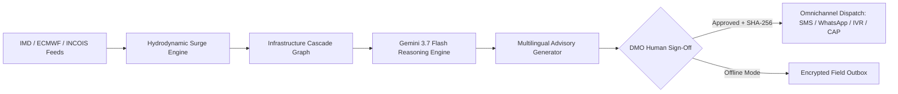

# 🌊 Project SURGE — Storm Understanding & Resilience Guidance Engine

[](https://vitejs.dev/)
[](https://react.dev/)
[](https://ai.google.dev/)
[](https://leafletjs.com/)
[](LICENSE)

> **72-Hour Anticipatory Climate Action Platform for Coastal Communities**  
> Developed as a high-readiness decision-support prototype for coastal disaster management authorities across the **Bay of Bengal cyclone corridor** (Odisha, West Bengal, Andhra Pradesh, Sundarbans).

---



---

## 📌 Executive Summary

Tropical cyclones in the Bay of Bengal cause catastrophic storm surges, inundating low-lying deltas and isolating millions of residents hours before landfall. Traditional forecasts deliver raw meteorological parameters (atmospheric pressure, wind knots) that municipal ward officers and disaster responders struggle to translate into operational evacuation schedules.

**Project SURGE** bridges the gap between raw storm physics and life-saving anticipatory field action. By coupling hydrodynamic storm surge simulations with graph-based infrastructure failure modeling and Google Gemini 3.7 Flash reasoning, SURGE produces **defensible, human-in-the-loop, multi-channel emergency advisories** in 6 regional languages up to 72 hours before cyclone landfall.

---

## ⚡ Key Modules & Capabilities

### 1. 🌀 AI-Powered Hazard Engine (Gemini 3.7 Flash)
- **Multi-Hazard Risk Rationales:** Synthesizes marine surge depth (m), gale gusts (km/h), and 24h precipitation into actionable plain-language briefings.
- **Demographic Vulnerability Weighting:** Cross-references structural vulnerability (kutcha/thatched dwellings) and dependency ratios to prioritize high-risk hamlets.
- **Defensible Decision Support:** Justifies mandatory evacuation timelines with defensible physics-equity rationales for Disaster Management Officers (DMO).

### 2. 🗺️ Storm Digital Twin Geospatial Map
- **Live Cyclone Tracks:** Visualizes multi-stage cyclone trajectories (T-72h, T-48h, T-24h, T-12h, Landfall).
- **Dynamic Inundation Contours:** Real-time rendering of marine surge depth overlays across coastal wards.
- **Critical Infrastructure GIS:** Tracks operational health of electrical substations, hospital power supplies, cellular masts, and arterial bridges.



### 3. 🕸️ Cascade Failure Modeling
- **Graph-Based Infrastructure Interdependency:** Simulates secondary and tertiary failure dominoes (e.g., substation flooding → hospital auxiliary failure → pump station trip → road culvert submergence).
- **Evacuation Bottleneck Detection:** Flags single-access coastal spines that flood hours before peak landfall, preventing trapped convoys.



### 4. 📢 Multilingual Advisory Dispatch Engine
- **6 Supported Languages:** Odia, Bengali, Telugu, Tamil, Hindi, and English.
- **Omnichannel Broadcast Generation:**
  - **SMS:** Concise cellular broadcast messages (<160 chars).
  - **WhatsApp:** Rich markdown format with bold threat levels, shelter directions, and emergency hotline numbers.
  - **Cell Broadcast (CAP):** Emergency Alert System (EAS) standardized protocol formats.
  - **IVR Voice Script:** Automated text-to-speech audio synthesis for low-literacy rural coastal populations.

### 5. 🛡️ Human-in-the-Loop Governance & SHA-256 Audit Trail
- **Strict Human Oversight:** AI drafts recommendations; certified government dispatchers review, edit, and sign off.
- **Cryptographic Audit Log:** Every approved dispatch generates a SHA-256 hash stamp logging approver identity, timestamp, channel, and target population for legal accountability.

### 6. 📶 Offline-First PWA Capabilities
- **Local Outbox Queue:** If field communication fails during cyclone approach, dispatches are encrypted into an indexed offline outbox that auto-syncs when gateways restore.

---

## 🏗️ Architecture Pipeline



---

## 🚀 Getting Started

### Prerequisites
- [Node.js](https://nodejs.org/) (v18.0.0 or higher)
- [npm](https://www.npmjs.com/) (v9.0.0 or higher)

### Installation

1. **Clone the repository:**
   ```bash
   git clone https://github.com/ssm2006/Project-SURGE.git
   cd Project-SURGE
   ```

2. **Install dependencies:**
   ```bash
   npm install
   ```

3. **Start local development server:**
   ```bash
   npm run dev
   ```
   Open [http://localhost:5173](http://localhost:5173) in your browser.

4. **Build for production:**
   ```bash
   npm run build
   ```
   Production-ready static bundle will be generated in `dist/`.

---


## 📍 Pilot Regions

| Region | State / Territory | Coastal Exposure | Vulnerability Hotspot |
| :--- | :--- | :--- | :--- |
| **Puri & Jagatsinghpur** | Odisha, India | Bay of Bengal Shelf | Kutcha settlements, single access coastal highway |
| **South 24 Parganas** | West Bengal, India | Sundarbans Delta | Tidal creek surge amplification, embankment breaches |
| **Sundarbans Delta** | Bangladesh border | Mangrove Buffer Zone | Extreme remote islands, high dependency ratio |
| **Vizag Coastal Belt** | Andhra Pradesh, India | Northern Circars Coast | Dense industrial port zone, steep gradient surges |

---

## 🛠️ Tech Stack

- **Frontend Core:** React 19, JavaScript (ESNext)
- **Bundler & Dev Server:** Vite 6
- **Styling:** Modular Light Theme Design System (CSS3 with modern design tokens)
- **Geospatial & Maps:** Leaflet & OpenStreetMap tiles
- **Icons:** Lucide React
- **Voice / Audio Synthesis:** Web Speech API & Multilingual TTS
- **AI Decision Support:** Google Gemini 3.7 Flash Integration Architecture

---

## 📄 License & Disclaimer

This project is open-source under the [MIT License](LICENSE).

> **Disclaimer:** Project SURGE is an advanced research and engineering prototype designed for disaster preparedness simulations and decision-support demonstrations. Real-world emergency evacuations must always follow official directives issued by the National Disaster Management Authority (NDMA) and the India Meteorological Department (IMD).
